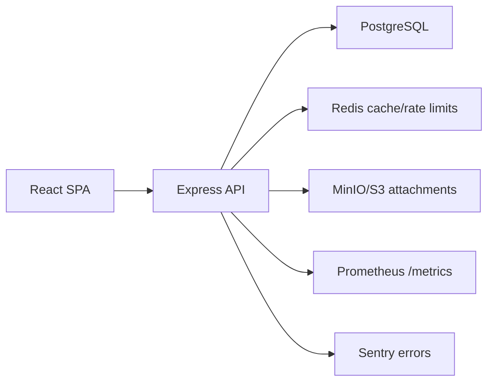
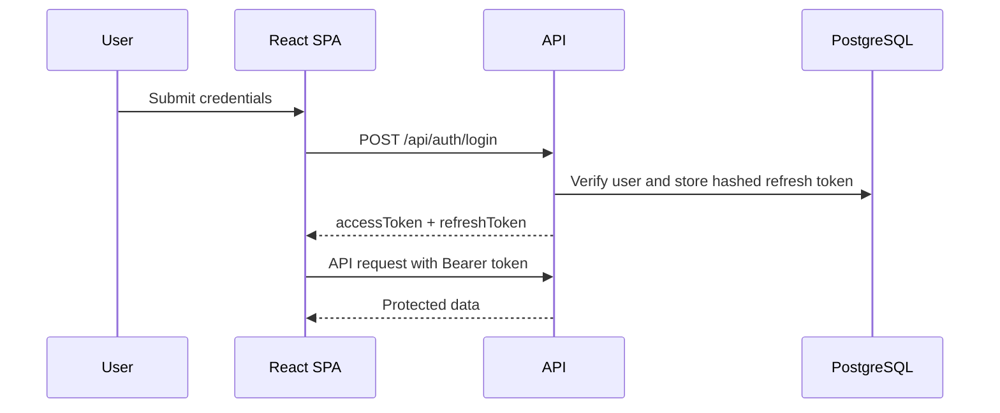

# Architecture

## Overview

AllAmericanEnergy is designed as a multi-tenant CRM. Organizations own users and CRM records. Every tenant-scoped query must include `orgId` from the authenticated principal unless the principal is a `superadmin`.

## Backend Layers

- `routes`: HTTP surface, request validation, authorization policy binding.
- `services`: business rules and tenant scoping.
- `db`: Prisma client and migrations.
- `security`: JWT, password hashing, RBAC, rate limits, request hardening.
- `observability`: structured logs, request IDs, metrics.

## Frontend Layers

- `app`: routing, authenticated layout, role-aware navigation.
- `features`: dashboards and CRM entity pages.
- `lib`: API client, auth store, permission helpers.
- `ui`: reusable controls and layout primitives.

## Auth Flow

## Data Isolation

`superadmin` may cross organization boundaries. All other roles are scoped to their own `orgId`, and service methods must reject mismatched organization access.
